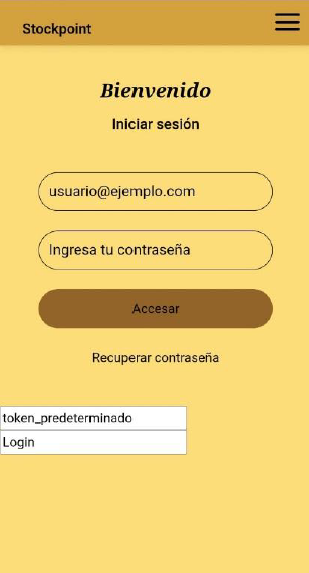
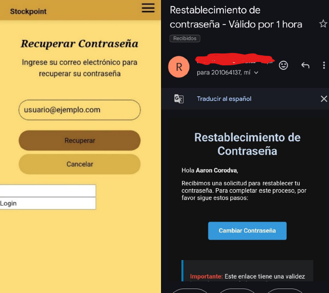
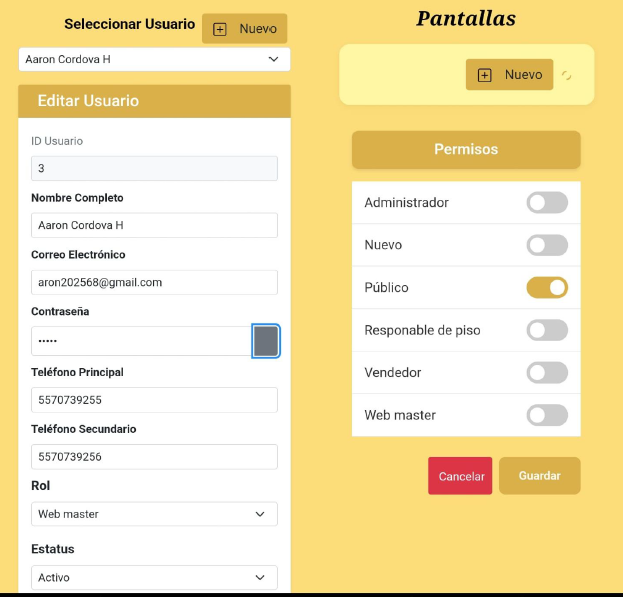
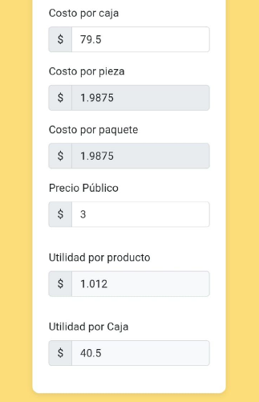
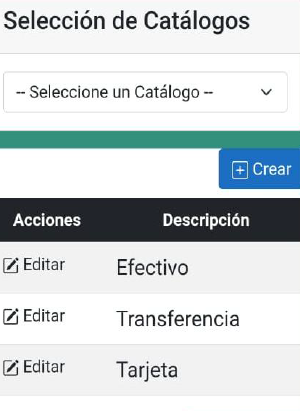
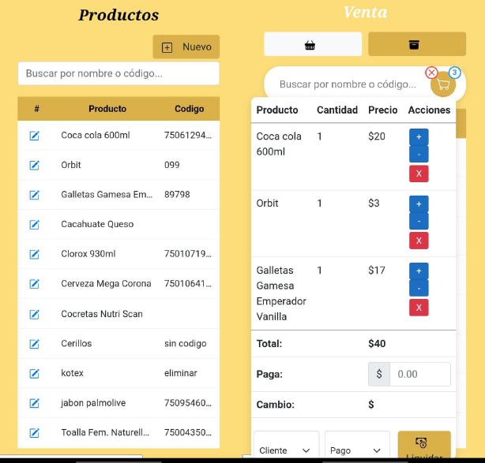
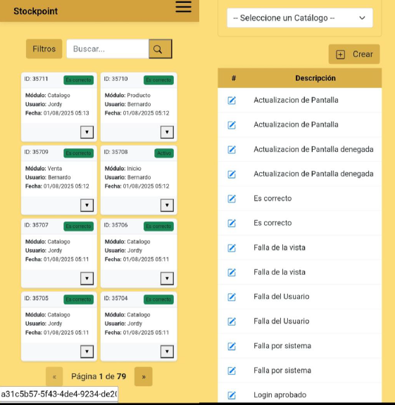

# Sistema Híbrido Desarrollado en .NET MAUIBlazor – Mobile

Aplicación **móvil multiplataforma** desarrollada como parte de un **sistema híbrido**, compartiendo arquitectura, lógica de negocio y modelo de datos con la aplicación web del mismo proyecto.

Compatible con **Android** y **iOS**, esta aplicación extiende la funcionalidad del sistema a dispositivos móviles.

---

<!--  -->

<!---->

## 🧠 Descripción General
Este proyecto consiste en el desarrollo de una aplicación de punto de venta con gestión de inventarios para la empresa **Sistemas Electrónicos Industriales y de Comunicación S.A. de C.V..** Su objetivo principal es automatizar los procesos de venta y control de inventario, eliminando los errores y retrasos asociados a la gestión manual.

La aplicación cuenta con versión web y móvil, permitiendo acceder a los procesos principales desde dispositivos móviles y manteniendo sincronización en tiempo real con la plataforma web.

Además, el núcleo del sistema ha sido adaptado para distintos dominios:

* Punto de Venta
* Historial Clínicos
* Aseguradora (Pólizas)

---

## 🔗 Proyecto Relacionado

Esta aplicación forma parte del mismo proyecto que:

* 🌐 Aplicación Web:  
  [StockpointWeb](https://github.com/jordyH54/StockpointWeb)

---

## 📱 Funcionalidades Principales

* Consulta y registro de información
* Control de operaciones en tiempo real
* Autenticación y control de accesos
* Visualización de datos
* Bitácora de actividades

---

## 🛠️ Tecnologías Utilizadas

* .NET MAUI
* C#
* SQL Server

---

## 🧩 Arquitectura

* Aplicación multiplataforma
* Consumo de servicios compartidos
* Arquitectura modular
* Reutilización de lógica de negocio

---

## 📌 Características Clave

* Android / iOS
* Multidominio
* Escalable
* Reutilizable
* Enfoque híbrido

## ⚙️ Resultados
# Módulo de Usuarios
El módulo de autenticación, ha demostrado que el sistema permite el inicio de sesión seguro solo a usuarios con credenciales válidas y protege correctamente contra accesos no autorizados.

  

La funcionalidad de recuperación de contraseña permite a los usuarios restablecer su acceso de forma segura en caso de olvido, con un flujo estable y protegido contra posibles vulnerabilidades

  

Los procesos de asignación de roles aseguran que el sistema otorga correctamente los permisos correspondientes a cada perfil 
(Usuario público, Vendedor,Responsable de piso, Administrador , Web Master), garantizando un control preciso sobre las acciones de los usuarios y contribuyendo a la seguridad y correcto funcionamiento de la plataforma.

**Perimisos de usuario**

* **Usuario público:**
Tiene acceso limitado al sistema, generalmente enfocado a la visualización de información básica sin necesidad de autenticación. No puede realizar modificaciones ni acceder a funciones administrativas.

* **Vendedor:**
Es responsable de las operaciones de venta dentro del sistema. Puede registrar ventas, seleccionar productos, aplicar métodos de pago y consultar información relacionada con sus transacciones. Su acceso está restringido a funciones operativas, sin permisos de configuración o administración general.

* **Responsable de piso:**
Supervisa las actividades de venta y el control de inventario. Puede consultar existencias, revisar movimientos de productos y apoyar en la gestión operativa del punto de venta. Su rol permite mayor acceso que el vendedor, pero sin llegar a funciones críticas del sistema.

* **Administrador:**
Cuenta con permisos amplios para gestionar el sistema. Puede administrar usuarios, productos, categorías, inventarios, métodos de pago y consultar reportes generales. Su función principal es asegurar el correcto funcionamiento y control de la plataforma.

* **Web Master:**
Tiene control total sobre la configuración del sistema web. Se encarga de la administración técnica, mantenimiento, configuración de catálogos, ajustes del sistema y gestión avanzada de usuarios y permisos.

  

# Módulo de Ventas e inventario
El módulo de registro de métodos de pago identifica y almacena de manera precisa el tipo de transacción (efectivo, tarjeta, transferencia u otro medio disponible). Cada operación queda correctamente registrada, lo que facilita la conciliación de ingresos, el control financiero y la generación de reportes detallados por tipo de pago, garantizando un funcionamiento estable, confiable y eficiente en la gestión de las transacciones.

  
    

La integración con el inventario permite que cada venta registrada, independientemente del método de pago, actualice automáticamente los niveles de stock. Esta conexión garantiza información en tiempo real, evita desfases y optimiza la gestión de los productos disponibles.

  

# Módulo de Reportes
El módulo de bitácora de actividades permite visualizar el estado del sistema y registrar de forma detallada los eventos más relevantes. Registra correctamente los intentos de acceso, especialmente los realizados por usuarios sin los permisos correspondientes, así como las actualizaciones de roles y permisos asignados. También captura errores del sistema, fallos en los procesos y todas las acciones de los usuarios dentro de la plataforma, cumpliendo con los objetivos de trazabilidad y seguridad. El acceso a la bitácora está restringido al usuario con rol de Web Master, garantizando la confidencialidad e integridad de la información, y asegurando un funcionamiento estable que constituye una herramienta clave para el control interno del sistema.

  

---

## 👨‍💻 Autores

**Jordy Manuel Hernandez Rosario** 
 
**Aaron Cordova Hernandez**
 
Ingenieros en Sistemas Computacionales
